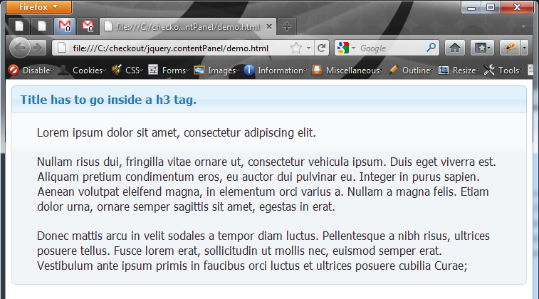

jQuery.contentPanel
========

A simple content panel heavilly inspired on
jQuery UI's accordion panels, but individual
and not animated. The panel uses CSS classes
used in Themeroller themes, so it's fully
themeable that way. 

Usage
-----
Your markup should look like this (using the Cupertino theme from jQueryUI.com):

    <html>
    <head>
        <link rel="stylesheet" type="text/css" href="jquery.contentpanel.css" />
        <link href="cupertino/jquery-ui.css" rel="stylesheet" type="text/css" />
    <head>
    <body>
        

            <h3>Title has to go inside a h3 tag.</h3>
            

                Here you can put whatever. Images, divs, p tags.
                Anything goes. I think.
            

        

        
            
        
    </body>
    </html>

Will produce something like this:

    
That's all there is to it. This plugin was developed 
against jQuery 1.5.1 and jQuery UI 1.8.14.